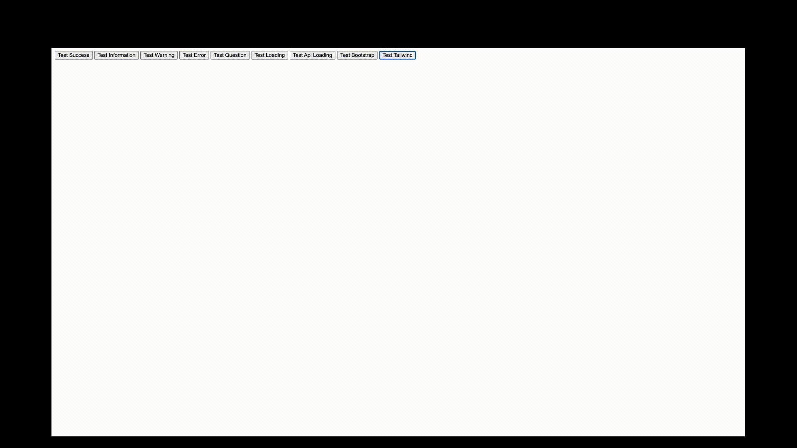

# Alert Kit

**Alert Kit** is a flexible and easy-to-use library for displaying alert messages in the browser. It provides a simple API for creating and managing alert messages, allowing you to display different types of messages with customizable styles and callbacks.

## Installation

To get started, install **Alert Kit** via npm:

```bash
npm install alert-kit
```

## Basic Usage



You can quickly create an alert message by calling the `show` method and passing an object with the desired options:

```javascript
import { AlertKit, alertKit } from "alert-kit";

// Initialize AlertKit
alertKit.show({
  headerTitle: "Alert Kit",
  type: "success",
  title: "Success",
  message: "!The operation was successful!",
  buttons: [
    {
      text: "Ok",
      onClick: () => console.log("Success clicked"),
      primary: true,
      type: "success",
    },
  ],
});

// Info alert
alertKit.show({
  headerTitle: "Alert Kit",
  type: "info",
  title: "Information",
  message:
    "This is a test information message with a very long text :D",
  onOpen: () => {
    console.log("The alert was opened");
  },
  onClose: () => {
    console.log("The alert was closed");
  },
});

// Warning alert
alertKit.show({
  headerTitle: "Alert Kit",
  type: "warning",
  title: "Warning",
  message:
    "This is a test warning message with a very long text :D",
  buttons: [
    {
      text: "Ok",
      onClick: () => console.log("Success clicked"),
      primary: true,
      type: "warning",
    },
  ],
});

// Error alert
alertKit.show({
  headerTitle: "Alert Kit",
  type: "error",
  title: "Error",
  message:
    "The operation failed with an error message :(",
  buttons: [
    {
      text: "Ok",
      onClick: () => console.log("Success clicked"),
      primary: true,
      type: "error",
    },
  ],
});

// Question alert
alertKit.show({
  headerTitle: "Alert Kit",
  type: "question",
  title: "Question",
  message: "Are you sure you want to proceed?",
  isMoveable: false,
  showCloseButton: false,
  closeOnEsc: false,
  closeOnClickOutside: false,
  buttons: [
    {
      text: "Yes",
      onClick: () => {
        alertKit.show({
          message: "Ok",
        });
      },
      primary: true,
      type: "question",
    },
    {
      text: "No",
      onClick: () => console.log("No clicked"),
      type: "error",
    },
  ],
});

// Loading alert
let interval = null;
let counter = 3;

// Función para limpiar el intervalo
const cleanup = () => {
  if (interval) {
    clearInterval(interval);
    interval = null;
  }
  counter = 3;
};

alertKit.show({
  type: "loading",
  message: `Please wait ${counter} seconds...`,
  showCloseButton: false,
  closeOnEsc: false,
  closeOnClickOutside: false,
  autoClose: true,
  autoCloseTime: 3000,
  buttons: [],
  onOpen: () => {
    // Asegurarse de que no haya intervalos previos
    cleanup();

    // Iniciar el nuevo intervalo
    interval = setInterval(() => {
      counter--;
      if (counter >= 0) {
        alertKit.message = `Please wait ${counter} seconds...`;
      }
    }, 1000);
  },
  onClose: () => {
    cleanup();
    alertKit.show({
      message: "First alert",
      type: "success",
    });
  },
});

document.getElementById("btnApiLoading").addEventListener("click", () => {
  alertKit.show({
    headerTitle: "Alert Kit",
    type: AlertType.question,
    title: "Api",
    message: "Are you sure you want to delete the API?",
    isMoveable: false,
    showCloseButton: false,
    closeOnEsc: false,
    closeOnClickOutside: false,
    buttons: [
      {
        text: "Aceptar",
        type: "success",
        primary: true,
        onClick: async () => {
          alertKit.show({
            type: AlertType.loading,
            bodyMessageInnerHTML: `
                <svg width="200" height="200" xmlns="http://www.w3.org/2000/svg">
                  <!-- Fondo -->
                  <rect width="100%" height="100%" fill="none"/>

                  <!-- Cara -->
                  <circle cx="100" cy="100" r="80" stroke="black" stroke-width="4" fill="yellow"/>

                  <!-- Ojo izquierdo -->
                  <circle cx="70" cy="70" r="10" fill="black"/>

                  <!-- Ojo derecho -->
                  <circle cx="130" cy="70" r="10" fill="black"/>

                  <!-- Boca -->
                  <path d="M 70 130 Q 100 160 130 130" stroke="black" stroke-width="4" fill="transparent"/>
                </svg>
                `,
            showCloseButton: false,
            closeOnEsc: false,
            closeOnClickOutside: false,
            autoClose: false,
          });

          await new Promise((resolve) => setTimeout(resolve, 2000));

          alertKit.show({
            headerTitle: "Alert Kit",
            type: AlertType.success,
            title: "Api",
            message: "Deleted successfully",
            buttons: [
              {
                text: "Oky",
                primary: true,
              },
            ],
          });
        },
      },
      {
        text: "Cancelar",
        type: "error",
      },
    ],
  });

  // Test using class Bootstrap

  // Load Bootstrap CSS dinamically
  // Cargar Bootstrap CSS dinámicamente
  const bootstrapCSS = document.createElement("link");
  bootstrapCSS.rel = "stylesheet";
  bootstrapCSS.href =
    "https://cdnjs.cloudflare.com/ajax/libs/bootstrap/5.3.2/css/bootstrap.min.css";
  bootstrapCSS.setAttribute("data-bootstrap", "");
  document.head.appendChild(bootstrapCSS);

  // Carga el estilo de Bootstrap
  alertKit.show({
    headerTitle: "Bootstrap",
    type: "info",
    title: "Information",
    message: "The alert was opened using Bootstrap CSS",
    buttons: [
      {
        text: "Aceptar",
        onClick: () => console.log("Botón aceptado"),
        primary: true,
        class: ["btn", "btn-danger"],
      },
    ],
    onClose: () => {
      // Remover Bootstrap CSS cuando se cierra el alert
      const bootstrapLink = document.querySelector("[data-bootstrap]");
      if (bootstrapLink) {
        bootstrapLink.remove();
      }
    },
  });
});

// Load Tailwind CSS dinamically
// Cargar Tailwind CSS dinámicamente
const tailwindCSS = document.createElement("link");
tailwindCSS.rel = "stylesheet";
tailwindCSS.href =
  "https://cdnjs.cloudflare.com/ajax/libs/tailwindcss/2.2.19/tailwind.min.css";
tailwindCSS.setAttribute("data-tailwind", "");
document.head.appendChild(tailwindCSS);

alertKit.show({
  overlayClass: ["italic", "bg-red-500", "text-green-700"],
  contentClass: ["rounded-none"],
  headerVisible: false,
  headerClass: ["bg-white"],
  headerTitle: "Tailwind",
  bodyIconStyle: "width: 50px;",
  bodyIconInnerHTML: ` <svg xmlns="http://www.w3.org/2000/svg" viewBox="0 0 24 24" fill="none" stroke="currentColor" stroke-width="2" stroke-linecap="round" stroke-linejoin="round">
                <path d="M22 11.08V12a10 10 0 1 1-5.93-9.14"></path>
                <polyline points="22 4 12 14.01 9 11.01"></polyline>
            </svg>`,
  type: "info",
  title: "Information",
  message: "The alert was opened using Tailwind CSS",
  buttons: [
    {
      text: "Aceptar",
      onClick: () => console.log("Botón aceptado"),
      primary: true,
      class: [
        "bg-blue-500",
        "hover:bg-blue-700",
        "text-white",
        "font-bold",
        "py-2",
        "px-4",
        "rounded-0",
        "focus:outline-none",
        "focus:ring-2",
        "focus:ring-offset-2",
        "focus:ring-blue-500",
      ],
    },
  ],
  onClose: () => {
    // Remover Tailwind CSS cuando se cierra el alert
    const tailwindLink = document.querySelector("[data-tailwind]");
    if (tailwindLink) {
      tailwindLink.remove();
    }
  },
});
```

## Customization Options

Customize your alerts with a variety of options by passing an object to the `alertKit` method:

```javascript
import { AlertKit, alertKit, AlertType } from "alert-kit";

alertKit.show({
  overlayClass: ["class1", "class2"],
  overlayStyle: "background-color: red;",
  backdropBlur: true,

  contentClass: ["class1", "class2"],
  contentStyle: "background-color: red;",

  headerVisible: true,
  headerClass: ["class1", "class2"],
  headerStyle: "background-color: red;",

  headerTitleClass: ["class1", "class2"],
  headerTitleStyle: "background-color: red;",
  headerTitleInnerHTML: "<h1>Title</h1>",

  headerCloseButtonClass: ["class1", "class2"],
  headerCloseButtonStyle: "background-color: red;",
  headerCloseButtonInnerHTML: "<h1>Title</h1>",

  bodyClass: ["class1", "class2"],
  bodyStyle: "background-color: red;",
  bodyInnerHTML: "<h1>body</h1>",

  bodyIconClass: ["class1", "class2"],
  bodyIconStyle: "background-color: red;",
  bodyIconInnerHTML: "<h1>bodyIcon</h1>",

  bodyTitleClass: ["class1", "class2"],
  bodyTitleStyle: "background-color: red;",
  bodyTitleInnerHTML: "<h1>bodyTitle</h1>",

  bodyMessageClass: ["class1", "class2"],
  bodyMessageStyle: "background-color: red;",
  bodyMessageInnerHTML: "<h1>bodyMessage</h1>",

  footerClass: ["class1", "class2"],
  footerStyle: "background-color: red;",
  footerInnerHTML: "<h1>footer</h1>",

  headerTitle: "Alert Kit",
  title: "Subtitle",
  message: "Message",
  type: AlertType.info,
  showCloseButton: true,
  closeOnEsc: true,
  closeOnClickOutside: true,
  isMoveable: true,
  buttons: [
    {
      text: "Yes",
      onClick: () => {
        console.log("Yes clicked");
      },
      primary: true,
      type: "info",
    },
    {
      text: "No",
      onClick: () => {
        console.log("No clicked");
      },
      type: "error",
    },
    {
      text: "That's it",
      onClick: () => {
        console.log("That's it");
      },
      type: "warning",
    },
  ],
  autoClose: false,
  autoCloseTime: 0,
  onOpen: () => {
    console.log("Open");
  },
  onClose: () => {
    console.log("Close");
  },
});

setTimeout(() => {
  alertKit.close();
}, 2000);
```

## Available Styles

Alert Kit offers multiple styles for your alerts:

### Information


### Success


### Warning


### Error


### Question


### Loading


### Bootstrap


### Tailwind


## Available Options

| Option                | Type       | Default                                                                             | Description                                                                                                       |
| --------------------- | ---------- | ----------------------------------------------------------------------------------- | ----------------------------------------------------------------------------------------------------------------- |
| `backdropBlur`        | `boolean`  | `true`                                                                              | Whether or not to blur the background of the alert.                                                               |
| `title`               | `string`   | `'Alert Title'`                                                                     | The title of the alert                                                                                            |
| `subTitle`            | `string`   | `'Subtitle'`                                                                        | The subTitle of the alert                                                                                         |
| `message`             | `string`   | `'Write your message here.'`                                                        | The content of the alert                                                                                          |
| `type`                | `string`   | `'info'`                                                                            | The type of the alert message. Options: `'info'`, `'success'`, `'warning'`, `'error'`, `'question'`, `'loading'`. |
| `showCloseButton`     | `boolean`  | `true`                                                                              | Whether or not to display a close button.                                                                         |
| `closeOnEsc`          | `boolean`  | `true`                                                                              | Whether or not to close the alert when the user presses the Esc key.                                              |
| `closeOnClickOutside` | `boolean`  | `true`                                                                              | Whether or not to close the alert when the user clicks outside of it.                                             |
| `isMoveable`          | `boolean`  | `true`                                                                              | Whether or not to allow the user to move the alert.                                                               |
| `buttons`             | `array`    | `[{text: 'Accept' html: '<span>Accept</span>', onClick: () => { }, primary: true}]` | An array of buttons to display in the alert.                                                                      |
| `autoClose`           | `boolean`  | `false`                                                                             | Whether or not to automatically close the alert after a specified time.                                           |
| `autoCloseTime`       | `number`   | `3000`                                                                              | The time in milliseconds to wait before automatically closing the alert.                                          |
| `onOpen`              | `function` | `undefined`                                                                         | Callback function that is called when the alert is opened.                                                        |
| `onClose`             | `function` | `undefined`                                                                         | Callback function that is called when the alert is closed.                                                        |
