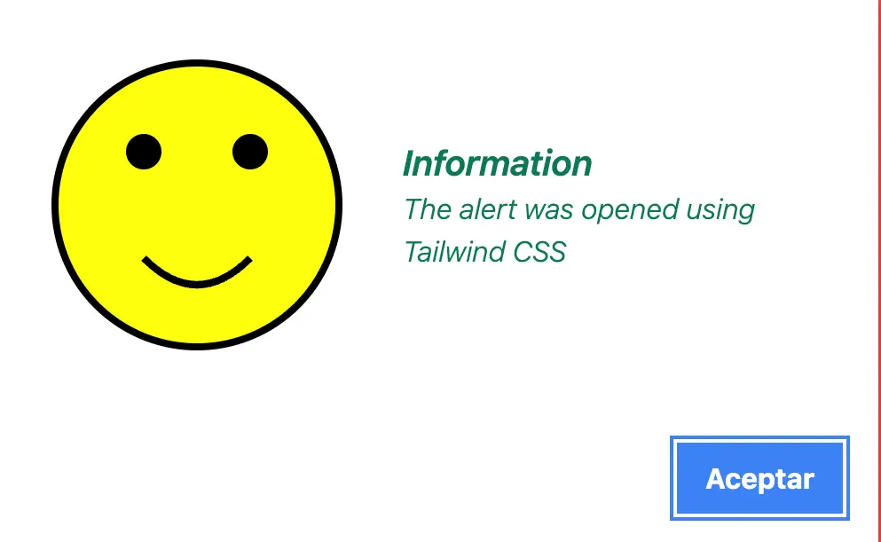

# Alert Kit

**Alert Kit** is a flexible and easy-to-use library for displaying alert messages in the browser. It provides a simple API for creating and managing alert messages, allowing you to display different types of messages with customizable styles and callbacks.

## Installation

To get started, install **Alert Kit** via npm:

```bash
npm install alert-kit
```

## Basic Usage

You can quickly create an alert message by calling the `show` method and passing an object with the desired options:

```javascript
import {  AlertKit, alertKit} from "alert-kit";

// Success alert
alertKit.show({
  type: "success",
  title: "Alert Kit",
  subTitle: "Success",
  message: "!The operation was successful!",
  buttons: [
    {
      text: "Aceptar",
      onClick: () => console.log("Success clicked"),
      primary: true,
    },
  ],
});

// Information alert
alertKit.show({
  type: "info",
  title: "Alert Kit",
  subTitle: "Information",
  message: "This is an informational message with a very long text :D",
  onOpen: () => {
    console.log("La alerta se abrió");
  },
  onClose: () => {
    console.log("La alerta se cerró");
  },
});

// Warning alert
alertKit.show({
  type: "warning",
  title: "Alert Kit",
  subTitle: "Warning",
  message: "This is a warning message with a very long text :D",
});

// Error alert
alertKit.show({
  type: "error",
  title: "Alert Kit",
  subTitle: "Error",
  message: "This is an error message with a very long text :D",
});

// Question alert
alertKit.show({
  type: "question",
  title: "Alert Kit",
  subTitle: "Question",
  message: "Are you sure you want to proceed?",
  isMoveable: false,
  showCloseButton: false,
  closeOnEsc: false,
  closeOnClickOutside: false,
  buttons: [
    {
      text: "Yes",
      onClick: () => {
        alertKit.show({
          message: "Ok",
        });
      },
      primary: true,
    },
    {
      text: "No",
      onClick: () => console.log("No clicked"),
      class: "error",
    },
  ],
});

// Loading alert
alertKit.show({
  type: "loading",
  message: `Please wait 3 seconds...`,
  showCloseButton: false,
  closeOnEsc: false,
  closeOnClickOutside: false,
  autoClose: true,
  autoCloseTime: 3000,
  buttons: [],
  onOpen: () => {
    console.log("Loading...");
  },
  onClose: () => {
    console.log("Loading finished");
  },
});

// Loading alert with callback
alertKit.show({
  type: "loading",
  message: `Loading api data...`,
  showCloseButton: false,
  closeOnEsc: false,
  closeOnClickOutside: false,
  autoClose: false,
  buttons: [],
  onClose: () => {
    alertKit.show({
      message: "Finished loading",
      type: "success",
    });
  },
});

setTimeout(() => {
  alertKit.close();
}, 5000);

// Load Bootstrap CSS dinamically
const bootstrapCSS = document.createElement("link");
bootstrapCSS.rel = "stylesheet";
bootstrapCSS.href =
  "https://cdnjs.cloudflare.com/ajax/libs/bootstrap/5.3.2/css/bootstrap.min.css";
bootstrapCSS.setAttribute("data-bootstrap", "");
document.head.appendChild(bootstrapCSS);

alertKit.show({
  type: "info",
  title: "SysSoftIntegra",
  subTitle: "Information",
  message:
    "Este es un mensaje de prueba de tipo información con un texto muy largo y con botones usando bootstrap :D",
  buttons: [
    {
      text: "Aceptar",
      onClick: () => console.log("Botón aceptado"),
      primary: true,
      otherClasses: "btn btn-danger",
    },
  ],
  onClose: () => {
    // Remover Bootstrap CSS cuando se cierra el alert
    const bootstrapLink = document.querySelector("[data-bootstrap]");
    if (bootstrapLink) {
      bootstrapLink.remove();
    }
  },
});

// Load Tailwind CSS dinamically
const tailwindCSS = document.createElement("link");
tailwindCSS.rel = "stylesheet";
tailwindCSS.href =
  "https://cdnjs.cloudflare.com/ajax/libs/tailwindcss/2.2.19/tailwind.min.css";
tailwindCSS.setAttribute("data-tailwind", "");
document.head.appendChild(tailwindCSS);

alertKit.show({
  type: "info",
  title: "SysSoftIntegra",
  subTitle: "Information",
  message:
    "Este es un mensaje de prueba de tipo información con un texto muy largo y con botones usando tailwind :D",
  buttons: [
    {
      text: "Aceptar",
      onClick: () => console.log("Botón aceptado"),
      primary: true,
      otherClasses:
        "bg-blue-500 hover:bg-blue-700 text-white font-bold py-2 px-4 rounded",
    },
  ],
  onClose: () => {
    // Remover Tailwind CSS cuando se cierra el alert
    const tailwindLink = document.querySelector("[data-tailwind]");
    if (tailwindLink) {
      tailwindLink.remove();
    }
  },
});
```

## Customization Options

Customize your alerts with a variety of options by passing an object to the `alertKit` method:

```javascript
import { AlertKit, alertKit, AlertType } from "alert-kit";

alertKit.show({
  title: "Alert Kit",
  subTitle: "Subtitle",
  message: "Message",
  type: AlertType.info,
  showCloseButton: true,
  closeOnEsc: true,
  closeOnClickOutside: true,
  isMoveable: true,
  buttons: [
    {
      text: "Yes",
      onClick: () => {
        console.log("Yes clicked");
      },
      primary: true,
    },
    {
      text: "No",
      onClick: () => {
        console.log("No clicked");
      },
      class: "error",
    },
    {
      text: "That's it",
      onClick: () => {
        console.log("That's it");
      },
      class: "info",
    },
  ],
  autoClose: false,
  autoCloseTime: 0,
  onOpen: () => {
    console.log("Open");
  },
  onClose: () => {
    console.log("Close");
  },
});
```

## Available Styles

Alert Kit offers multiple styles for your alerts:

### Information


### Success


### Warning


### Error


### Question


### Loading


### Bootstrap


### Tailwind




## Available Options

| Option     | Type       | Default                      | Description                                                                                                                 |
| ---------- | ---------- | ---------------------------- | --------------------------------------------------------------------------------------------------------------------------- |
| `backdropBlur` | `boolean` | `true`                       | Whether or not to blur the background of the alert.
| `title`    | `string`   | `'Alert Title'`              | The title of the alert |
| `subTitle`    | `string`   | `'Subtitle'`              | The subTitle of the alert |
| `message`  | `string`   | `'Write your message here.'` | The content of the alert |
| `type`    | `string`   | `'info'`                    | The type of the alert message. Options: `'info'`, `'success'`, `'warning'`, `'error'`, `'question'`, `'loading'`. |
| `showCloseButton` | `boolean` | `true`                       | Whether or not to display a close button.                                                                    |
| `closeOnEsc` | `boolean` | `true`                       | Whether or not to close the alert when the user presses the Esc key.                                                                    |
| `closeOnClickOutside` | `boolean` | `true`                       | Whether or not to close the alert when the user clicks outside of it.                                                                    |
| `isMoveable` | `boolean` | `true`                       | Whether or not to allow the user to move the alert.
| `buttons` | `array` | `[{text: 'Accept' html: '<span>Accept</span>', onClick: () => { }, primary: true}]`                       | An array of buttons to display in the alert.
| `autoClose` | `boolean` | `false`                       | Whether or not to automatically close the alert after a specified time.
| `autoCloseTime` | `number` | `3000`                       | The time in milliseconds to wait before automatically closing the alert.                                                                    |
| `onOpen` | `function` | `undefined`                  | Callback function that is called when the alert is opened.                                                                  |
| `onClose` | `function` | `undefined`                  | Callback function that is called when the alert is closed.                                                                  |